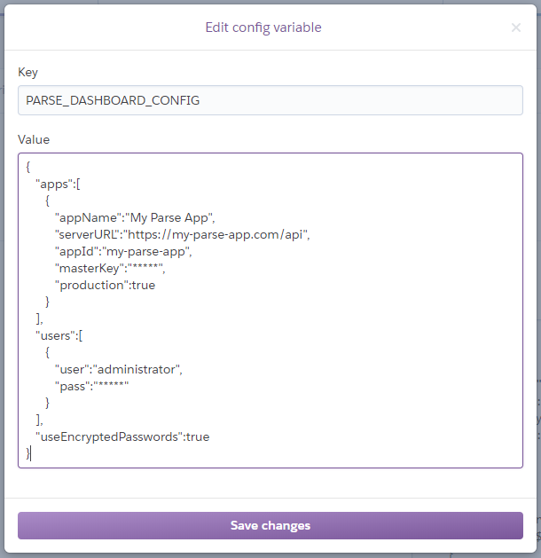

## Parse Dashboard on Heroku

This project gets you your own **[Parse Dashboard](https://github.com/parse-community/parse-dashboard)** instance on **[Heroku](https://heroku.com)** with the click of a button. Nothing local, no forks, no messing around. Create it when you need it, and destroy it when you're done.

### CORS

You will need to enable Cross-Origin Resource Sharing (CORS) for your new dashboard URL on each of your Parse Server instances. Otherwise, the dashboard will not be able to connect to them.

### Configuration

To prevent you from accidentally leaking your `masterKey` or login credentials, no dashboard configuration is stored in this repository. All of the config is saved in a single environment variable in Heroku called `PARSE_DASHBOARD_CONFIG`. (If you want to keep a versioned copy of your config elsewhere use a private GIST or similar.)

The dashboard configuration is just a JSON blob, which comes pre-populated with this basic template:

    {
      "apps": [
        {
          "appName": "My Parse App",
          "serverURL": "https://my-parse-app.com/api",
          "appId": "my-parse-app",
          "masterKey": "*****",
          "production": true
        }
      ],
      "users": [
        {
          "user": "administrator",
          "pass": "*****"
        }
      ],
      "useEncryptedPasswords": true
    }

For each of the Parse Server instances you want to add, replace the app details and user information above with your own.

If you get your config wrong, the dashboard will fail to boot properly. Investigate the application logs in Heroku and the error should become apparent.

A more advanced dashboard configuration could look like this:

    {
      "apps": [
        {
          "appName": "My First Parse App (PROD)",
          "serverURL": "https://my-parse-app-1.com/api",
          "appId": "my-parse-app-1",
          "masterKey": "*****",
          "readOnlyMasterKey": "*****",
          "production": true,
          "supportedPushLocales": ["en"],
          "primaryBackgroundColor": "#993333",
          "secondaryBackgroundColor": "#BF3F3F"
        },
        {
          "appName": "My First Parse App (DEV/TEST)",
          "serverURL": "https://my-parse-app-1-test.com/api",
          "appId": "my-parse-app-1-test",
          "masterKey": "*****",
          "supportedPushLocales": ["en"],
          "primaryBackgroundColor": "#59A5A5",
          "secondaryBackgroundColor": "#4CB2B2"
        },
        {
          "appName": "My Second Parse App (DEV/TEST)",
          "serverURL": "https://my-parse-app-2.com/api",
          "appId": "my-parse-app-2",
          "masterKey": "*****",
          "supportedPushLocales": ["en"]
        }
      ],
      "users": [
        {
          "user": "administrator",
          "pass": "*****"
        },
        {
          "user": "customer",
          "pass": "*****",
          "apps": [{"appId": "my-parse-app-1", "readOnly": true}]
        }
      ],
      "useEncryptedPasswords": true
    }

See also the excellent documentation [here](https://github.com/parse-community/parse-dashboard/blob/master/README.md) - there are a lot of other options you can mix-in to customise your dashboard.

### Pro-Tips / Gotchas

#### Secure Authentication

Dashboard logins must be done via a secure connection; however, because Heroku proxies traffic to the dashboard, it cannot detect if `https` is being used. Therefore, the dashboard is started with the `--trustProxy=1` option.

#### Server URLs

Make sure that your `serverURL` values have the mount path on the end i.e. `/api` (see template).

#### Usernames and Passwords

Make sure you use encrypted passwords, which is activated by the option `useEncryptedPasswords: true` (as shown in the template). As per the Parse Dashboard documentation, hashing is done with **bcrypt**, so use a tool like [this](https://www.bcrypt-generator.com) to generate the hashed versions of your passwords.

### Forking

If you find modifying the dashboard configuration via an environment variable too cumbersome (or want to use some advanced configuration options i.e. icons), feel free to fork this repository and store your configuration in it. You can then commit your own config file and other artifacts, and connect everything up to Heroku manually.

**Please make sure your repository is private.**

You will also need to update the `start` script line in [`package.json`](./package.json) to point the dashboard at your local configuration file i.e. `--config my-dashboard-config.json`.
